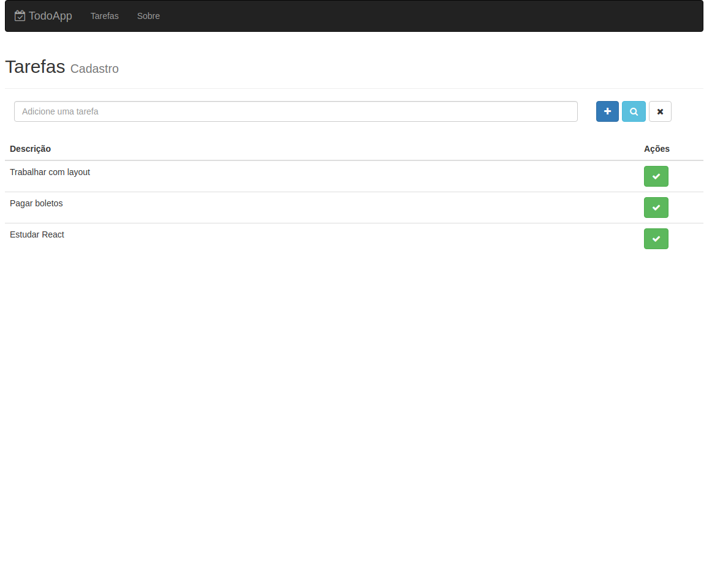
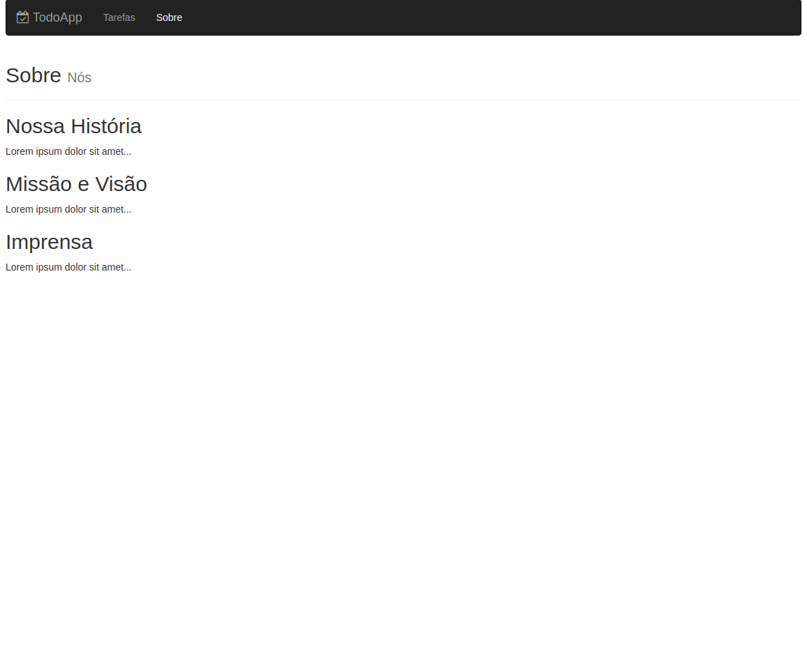
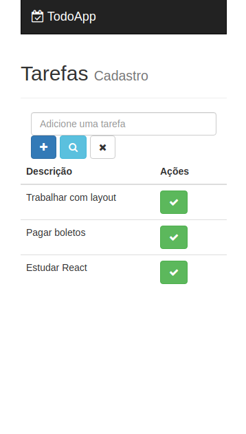

# Lista de Tarefas Utilizando React

* Projeto de estudos utilizando React
* Foi utilizado:

    * BootStrap

    * MongoDB

    * NodeJs

Para inicializar o projeto:

```
    npm install
```
  
Para rodar tanto na parte de backend e frontend:

```
    npm run dev
```

Imagens do projeto:

* Modo desktop:

<p align="center">


</p>

* Modo Mobile:


<p align="center">


</p>

